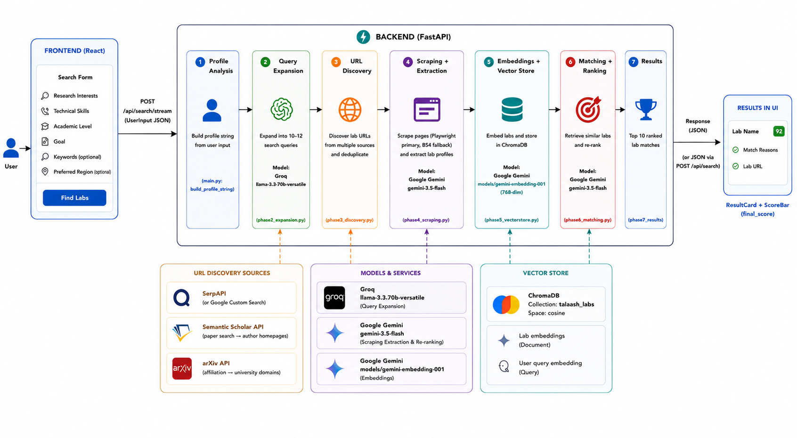

# Talaash

`talaash` (تلاش) is an Urdu word meaning `search` or `quest.`



This tool is build to help researchers and students 
in finding research labs and groups that genuinely match their interests, skills, and goals. It is an intelligent 
research lab discovery platform that combines artificial intelligence, web scraping, and knowledge matching.

Whether you're looking for collaboration opportunities, internships, or exploring potential research partnerships, Talaash streamlines the discovery process.

## Setup

### Requirements
- Python 3.11 or newer
- Node.js 18 or newer
- `pnpm` package manager

## Environment

Copy the example environment file into a new `.env` file:

```bash
cd backend
copy .env.example .env
```

Then edit `backend/.env` and add your API keys:

- `GROQ_API_KEY`
- `GEMINI_API_KEY`
- `SERPAPI_KEY`
- `GOOGLE_CSE_KEY`
- `GOOGLE_CSE_CX`

The backend loads these values from `backend/config.py`. The application will fail to start if `GROQ_API_KEY` or `GEMINI_API_KEY` are missing.

> Keep `backend/.env` private and do not commit it to source control.

## Local development

### Backend

```bash
cd backend
python -m venv venv
# Activate on Windows PowerShell:
venv\Scripts\Activate.ps1
# Activate on Windows CMD:
venv\Scripts\activate
# Activate on macOS / Linux:
source venv/bin/activate
pip install -r requirements.txt
uvicorn main:app --reload
```

### Frontend

```bash
cd frontend
pnpm install
pnpm dev
```

## Notes

- If you see errors while starting the backend, verify that all required environment variables are set.
- The frontend is served by Vite and should be available at `http://localhost:5173` by default.
- The backend runs on Uvicorn and uses FastAPI for its API endpoints.

## License

[License](./LICENSE)